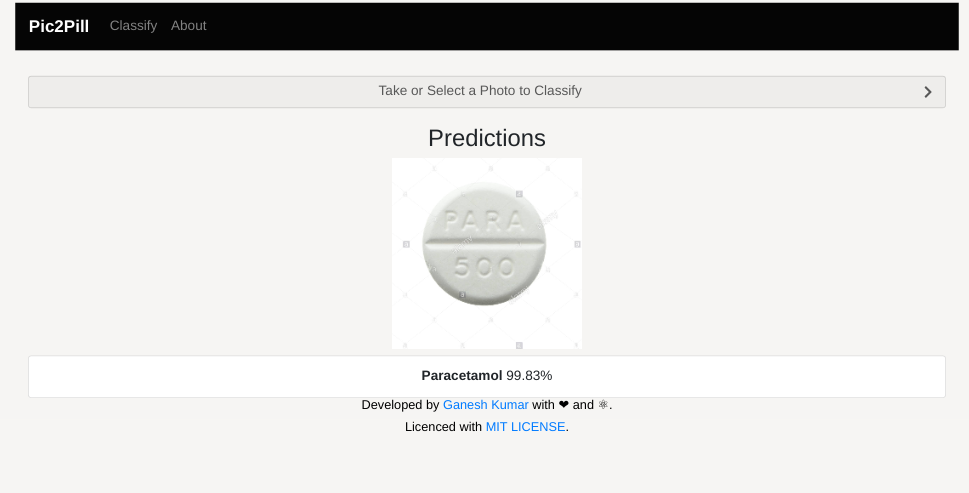
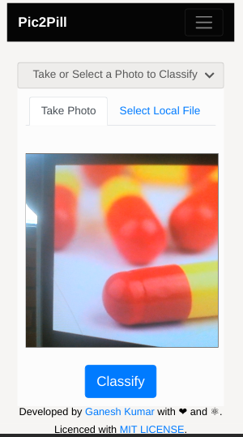
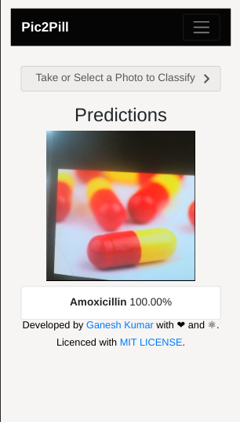

<h1 align="center">
   
  
   
  PicToPill
   
</h1>

<h4 align="center">A Progressive Web based Pill Classification App</h4>

  
  
  
   
  
  

## Motive
After creating deep learning models, users typically want to deploy their trained models to be used
in their applications. There are several ways to do this, and how users do it depends largely on
their use cases and requirements. One such requirement is the ability to run a model offline in
areas where Internet connectivity may be sparse or nonexistent. To do this, one solution is to
create native apps for mobile platforms which will package and load a compressed version of their
models. However, this has the overhead of needing developers with expertise in Android and iOS
development.

Here, we go over an alternative, easier way to satisfy this offline mobile
requirement by
creating a [progressive web application](https://developers.google.com/web/progressive-web-apps/)
with our model using React and TensorFlow.js. Progressive web applications (PWAs) give a native
app-like feel and can run on most modern web browsers. This makes cross-platform development much
easier as the application only has to be developed once in HTML/JavaScript. Furthermore, through
the use of [service workers](https://developers.google.com/web/fundamentals/primers/service-workers/),
PWAs can provide fully offline functionality.

With [TensorFlow.js](https://www.tensorflow.org/js), we can convert our pre-trained TensorFlow or
Keras models into JavaScript to be run in the browser through the app!

In then end, we will have a cross-platform application where users can classify
images selected locally or taken with their device's camera. The app uses TensorFlow.js and a
pre-trained model converted to the TensorFlow.js format to provide the inference capabilities.
This model is saved locally in the browser using IndexedDB, and a service worker is used to
provide offline capabilities.

## Flow

1. A pre-trained Keras/TensorFlow model is converted to the TensorFlow.js web friendly format and
   integrated with app.
2. User launches progressive web application.
3. App assets and TensorFlow.js model files are downloaded from the web.
4. Assets and model are stored locally using browser cache and IndexedDB storage.
5. User takes photo with device camera or selects local image.
6. Image is sent through the model for inference and top predictions are given.

## Included Components

* [React](https://reactjs.org/): A JavaScript library for building user interfaces.
* [TensorFlow.js](https://js.tensorflow.org/): A JavaScript library for training and deploying ML
   models in the browser and on Node.js.

## Featured Technologies

* [Deep Learning](https://www.youtube.com/playlist?list=PLZHQObOWTQDNU6R1_67000Dx_ZCJB-3pi): Subset of AI that uses
  multi-layers neural networks that learn from lots of data.
* [Mobile](https://www.tensorflow.org/lite): An environment to
 develop apps and enable engagements that are designed specifically for mobile
 users.
* [Web Development](https://reactjs.org/): The construction of
  modern web apps using open-standards technologies.
* [Visual Recognition](https://www.tensorflow.org/tutorials/images/classification): Tag, classify, and train
  visual content using machine learning.

## Key Concepts

**Data remains on-device and classification is performed locally** 
No image is ever uploaded to the server because with TensorFlow.js, inference is done locally, and
user data is kept private. There is no need for a persistent network connection to continue performing inferences.

**Assets are stored in browser cache and storage** 
On the user's first visit, a service worker is used to cache page resources (i.e. HTML, CSS, and JS files).
Each device must have network connectivity for this first visit, but on subsequent visits, the app
will still load and work as assets will be served from the cache. Similarly on the first visit,
the pre-trained model is downloaded and saved in [IndexedDB](https://developer.mozilla.org/en-US/docs/Web/API/IndexedDB_API),
a browser API for client-side storage. Subsequent loads to the page will retrieve the model from IndexedDB if
it is available. This saves from having to continually re-download the model.

**App can run on desktop and be 'installed' on mobile** 
Regardless of what platform the user is on, as long as the app is run on a modern browser, everything
should work. With the use of our [manifest file](https://developers.google.com/web/fundamentals/web-app-manifest/),
the app can be 'installed' on mobile devices, making it look like a native app with its own app icon
on the home screen.

**Content can still be updated by prompting the user** 
Since content is served cache/storage first, we need a way to serve new content to the end-user.
For this, when new content is available a new service worker is ready to be installed, the user is
notified with a prompt to reload the page and get the latest changes. For updating the
pre-trained model, we use a server API endpoint to query the date the model on the server was last
updated. If the app can hit the endpoint and detects the locally saved model is older than the model on
the server, the user is given a prompt with the option to update.

## Using the Pic2Pill

The app allows you to either use your device's camera to snap an image or select a local image from
the device's filesystem. Select an image of an object or put the object in frame using your camera,
then click classify. Local inference will then be performed, and the top result will be given.

   
   
  
  
  

## Links

* [TensorFlow.js](https://www.tensorflow.org/js)
* [React](https://reactjs.org/)
* [Progressive Web Apps](https://developers.google.com/web/progressive-web-apps/)
* [Service Workers](https://developer.mozilla.org/en-US/docs/Web/API/Service_Worker_API)
* [Web App Manifest](https://developers.google.com/web/fundamentals/web-app-manifest/)
* [IndexedDB](https://developer.mozilla.org/en-US/docs/Web/API/IndexedDB_API)
* [React Bootstrap](https://react-bootstrap.github.io/)

## License

This code pattern is licensed under the [MIT License](./LICENSE).
